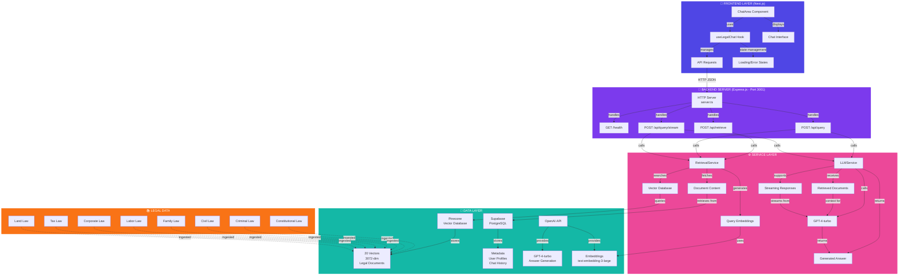
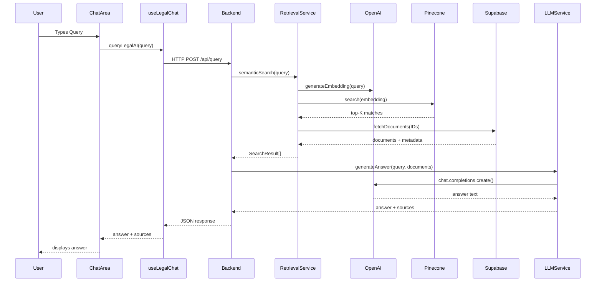
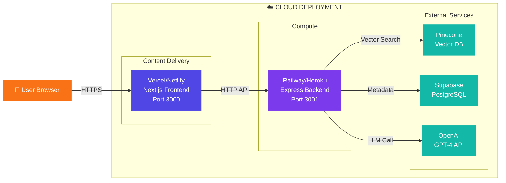

## Full Architecture as Code

Here's the complete Mermaid code for a comprehensive system architecture diagram. Copy and paste this into [Mermaid Diagram Generator](https://mermaid.live/) to visualize the complete project structure.

### Key Components Shown:

**🎨 Frontend Layer (Next.js)**
- ChatArea Component
- useLegalChat Hook
- API Requests
- Chat Interface
- State Management

**🚀 Backend Server (Express.js)**
- HTTP Server (Port 3001)
- 4 Endpoints (health, retrieve, query, stream)

**⚙️ Service Layer**
- RetrievalService (semantic search)
- LLMService (answer generation)
- Embedding generation
- Vector search
- Document retrieval

**💾 Data Layer**
- Pinecone (vector storage, 20 indexed documents)
- Supabase (metadata and user data)
- OpenAI (models for generation and embeddings)

**📚 Legal Data**
- 8 categories of Uganda law
- 20 ingested document chunks

### How to Use:

1. Go to [Mermaid Live Editor](https://mermaid.live/)
2. Paste the code above
3. Click "Draw" or wait for auto-rendering
4. Export as PNG, SVG, or embed in documentation

### Alternative: Sequence Diagram Version

If you want to show the data flow sequence instead:

### Alternative: Deployment Architecture

Choose the diagram type that works best for your documentation!
